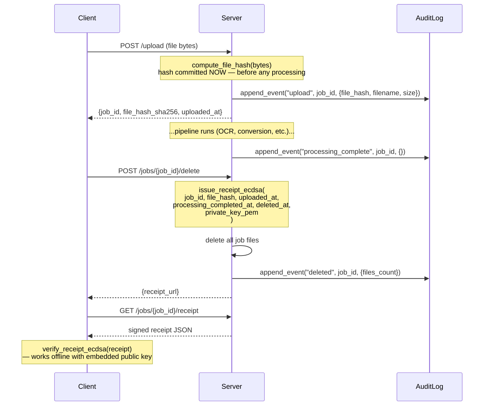
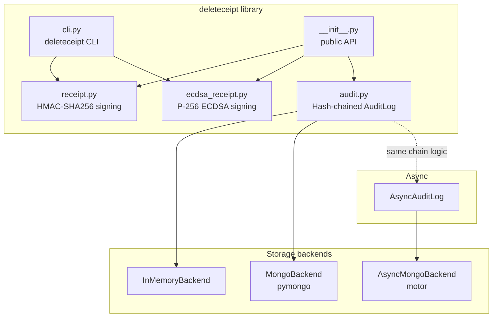

# Architecture: deleteceipt Lifecycle

## Lifecycle diagram



## Full component map



---

## Why pre-deletion hashing matters

The core non-obvious property of this library is **when** the file hash is
computed: at upload time, not at deletion time.

### The fabrication attack

Imagine a document-processing service that hashes the file *at the moment it
issues the deletion receipt* — i.e., after the bytes are already gone. What
would it hash? It could hash an empty byte string, or a single zero byte, or
any convenient stand-in value. There is no longer any external constraint on
the hash: the file does not exist to contradict it.

A dishonest operator could therefore:
1. Delete the file.
2. Choose a hash value that matches whatever policy requires (e.g., "original
   file with PII removed").
3. Sign a receipt containing that fabricated hash.

The receipt would be cryptographically valid — the signature would check out —
but the hash would not correspond to anything the user actually uploaded.

### The pre-deletion commitment

`deleteceipt` breaks this attack by separating the **commitment** (hashing)
from the **deletion** (discarding):

```
UPLOAD TIME                     DELETION TIME
-----------                     -------------
client → server: file bytes     server: delete job directory
                                server: issue_receipt(
server: hash = SHA-256(bytes)       job_id=...,
server: store hash in DB            file_hash=hash,  ← taken from DB
                                    deleted_at=now,
                                    ...
                                )
```

By the time the server issues the receipt, the hash is already committed in a
datastore. The server cannot change it retroactively (doing so would break the
hash-chain in the AuditLog and be detectable). The hash *proves* what bytes
existed at upload time, and the receipt *proves* those bytes were later deleted.

### Why a signature alone isn't enough

A valid cryptographic signature tells you that the *signer* produced this
receipt. It does not tell you that the *contents* are accurate. Pre-deletion
hashing is the mechanism that anchors the receipt contents to an observable,
tamper-evident reality.

### The role of the AuditLog

The hash-chained `AuditLog` extends this guarantee to the entire event
history. Every audit entry includes a `prev_hash` linking it to the preceding
entry. Modifying any historical entry (e.g., changing a stored file hash)
breaks the chain at that entry and all subsequent ones, making retroactive
revision detectable during `verify_chain()`.

Together, pre-deletion hashing and hash-chained audit entries make the system
resistant to both fabrication (inventing hashes after the fact) and revision
(altering the historical record).
